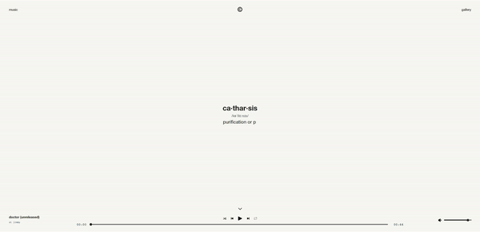
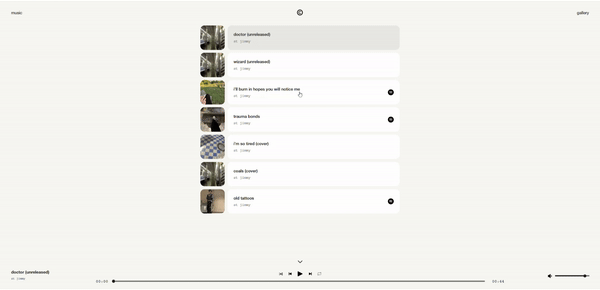
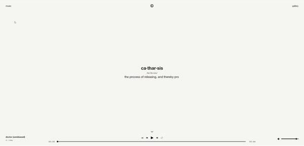

# catharsis
**ca·thar·sis** - *the process of releasing, and thereby providing relief from, strong or repressed emotions.*

Welcome to Catharsis, a digital space that intertwines a music player, playlist, and gallery, meticulously crafted to articulate my individuality through the harmonious blend of music and photography.

The web application is dynamically designed to function seamlessly on both mobile and desktop platforms, offering a versatile and immersive experience.

Catharsis is an ongoing project, symbolizing the continual exploration and expression of my creative journey.

***live demo currently unavailable***

### Home

### Interactive Music Playlist

The current musical selection is stored within a Redux store, ensuring uninterrupted playback across the entire website.

### An Emphasis on Fluidity

Page and component animations enhance user experience, gracefully appearing on component mount and disappear on unmount, powered by the Framer Motion library.

### Mobile-Friendly

With a strong aversion to non-mobile-friendly websites, I prioritized a mobile-first design philosophy. The result is a user-friendly experience across all devices.

Explore the intersection of emotion, music, and visuals on Catharsis - where creativity knows no bounds.

### General To-Do

* Enhance photobook functionality with the ability to zoom in and include comments on individual pictures.
    
* Implement efficient lazy loading for improved performance on the photobook.
    
* Finalize the user settings page to ensure a comprehensive and polished user experience.
    
* Complete the database integration for seamless dynamic fetching and uploading of music and photos.

* Eventual plan of scaling up to a complete social media site.
